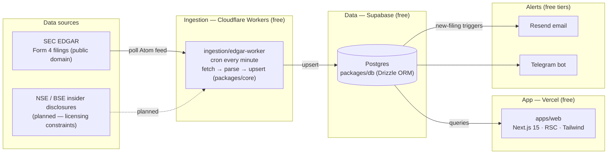

# InsiderFlow

[](https://github.com/insiderflow/insiderflow/actions/workflows/ci.yml)
[](LICENSE)

**Open-source, real-time, multi-market insider-trading tracker.**

> ## ⚠️ NOT INVESTMENT ADVICE
>
> InsiderFlow republishes public regulatory filings for **research and education only**. Nothing
> in this project — data, classifications, alerts, or UI — is investment advice, a
> recommendation, or an offer to buy or sell any security. Filings can be late, amended,
> incomplete, or wrong, and insider activity is not a reliable predictor of returns. **Do your
> own research and consult a licensed professional before making investment decisions.** The
> authors and contributors accept no liability for decisions made using this software or its
> data.

## Vision

When a CEO buys a million dollars of their own stock, that fact is public — but buried in
regulatory filings that most people never read. InsiderFlow watches those filings in real time,
normalizes them into one clean multi-market schema, and makes them searchable, followable, and
alertable. Open source (AGPL-3.0), free-tier deployable end to end, and owned by nobody.

**Today**: SEC EDGAR Form 4 ingestion (US). **Planned**: more filing types (Forms 3/5, 13D/G),
more markets (see the legal notes below), watchlists, and email/Telegram alerts.

## Architecture



### Monorepo layout

```
insiderflow/
├── apps/
│   └── web/                 # Next.js 15 (App Router, RSC, Tailwind CSS)
├── packages/
│   ├── core/                # Shared types, normalization, SEC transaction-code enums
│   └── db/                  # Drizzle ORM schema + Postgres client
├── ingestion/
│   └── edgar-worker/        # Cloudflare Worker: EDGAR cron ingestion
└── .github/workflows/       # CI: typecheck, lint, test, build
```

## Getting started

```bash
pnpm install
docker compose up -d   # local Postgres (or use a Supabase project)
pnpm db:migrate        # apply migrations (includes the pg_trgm extension)
pnpm dev               # web app on http://localhost:3000

# run the ingestion worker locally (1-min cron; use --test-scheduled trigger)
pnpm --filter @insiderflow/edgar-worker dev

# backfill the last 30 days of Form 4 filings from the EDGAR full-index
pnpm backfill -- --days=30 --forms=4
```

Copy `.env.example` → `.env` and `ingestion/edgar-worker/.dev.vars.example` → `.dev.vars` and
fill in your values. Quality gates: `pnpm typecheck && pnpm lint && pnpm test && pnpm build`.

## Free-tier deployment

The entire stack runs on free tiers — **no paid services required**:

| Piece           | Service            | Free tier that matters                         |
| --------------- | ------------------ | ---------------------------------------------- |
| Web app         | Vercel Hobby       | Next.js hosting, RSC, edge network             |
| Database        | Supabase Free      | 500 MB Postgres + REST API + connection pooler |
| Ingestion       | Cloudflare Workers | 100k requests/day + cron triggers              |
| Email alerts    | Resend             | 100 emails/day                                 |
| Telegram alerts | Telegram Bot API   | Free, unlimited for this scale                 |

Deploy: point Vercel at `apps/web`, create a Supabase project and set `DATABASE_URL`
(transaction-pooler URL), then `pnpm --filter @insiderflow/edgar-worker deploy` with secrets set
via `wrangler secret put`.

## Legal / data-source notice

- **SEC EDGAR (US)** — EDGAR filings are US-government works in the **public domain** and free
  to redistribute. Access must follow the
  [SEC fair-access policy](https://www.sec.gov/os/accessing-edgar-data): a descriptive
  `User-Agent` (see `EDGAR_USER_AGENT` in `.env.example`) and no more than 10 requests/second.
- **NSE / BSE (India)** — Indian exchange insider-disclosure data is published on exchange
  websites **under restrictive terms of use; bulk scraping and redistribution are generally not
  permitted without a license.** InsiderFlow therefore does **not** ship NSE/BSE ingestion or
  redistribute that data. The multi-market schema is ready, but India support is gated on
  properly licensed or user-supplied data. If you deploy your own instance, complying with the
  exchanges' terms is your responsibility.
- Data is provided **as is**, with no warranty of accuracy, completeness, or timeliness.

## Contributing

See [CONTRIBUTING.md](CONTRIBUTING.md). Good first areas: Form 4 XML parsing, alert routing,
watchlist UI.

## License

[AGPL-3.0](LICENSE). If you run a modified InsiderFlow as a network service, the AGPL requires
you to offer your users the modified source.
