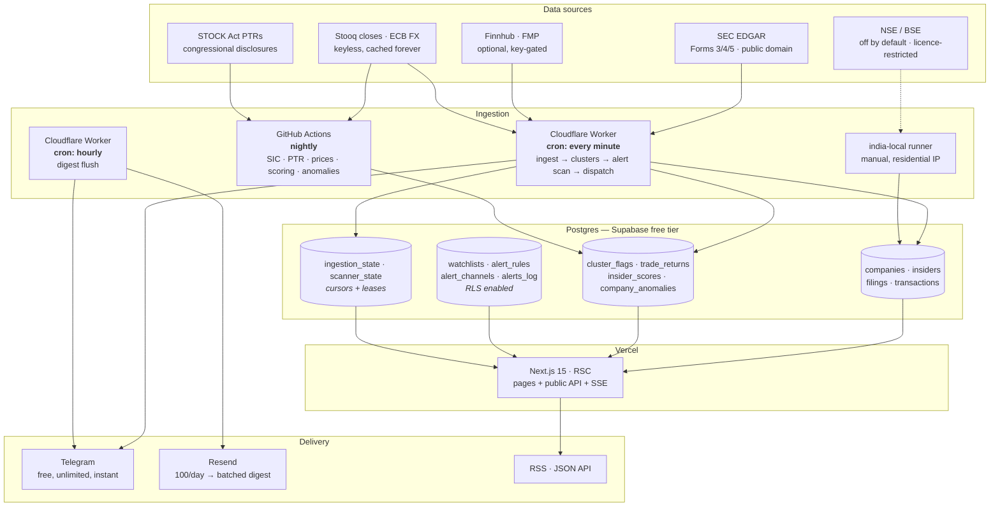

# Architecture

## The shape of it

## Why the pieces sit where they do

**Ingestion is a Cloudflare Worker, not a GitHub Action.** Actions' shortest
schedule is 5 minutes and it queues under load, so a 60-second filing-to-feed
target is unreachable. Cloudflare gives 5 free cron triggers at one-minute
granularity. We use 2.

**Nightly analytics is a GitHub Action, not a Worker.** None of it has a
60-second deadline, several steps pull tens of megabytes or make hundreds of
rate-limited requests, and Workers have a CPU budget per invocation. Being on
Actions also keeps the worker's remaining 3 cron triggers free.

**The web app never calls its own API.** Server components query the shared
Drizzle layer directly. An HTTP self-call inside a serverless function pays a
second cold start and a second network hop for data the process could have
fetched itself, and it turns one failure domain into two.

**The alert scanner is cursor-driven over `transactions`, not triggered by
ingestion.** Rows arrive from the worker, the Actions backfill, and the optional
India runner. A scanner that only ran when _it_ wrote something would miss the
other two.

## Data flow, one filing at a time

1. The worker polls EDGAR's Atom feed, diffs against `ingestion_state`.
2. Each new accession is fetched, the `ownershipDocument` XML parsed, and rows
   normalized: SEC code taxonomy, role flags, native currency + USD via cached
   FX, and a `routine` / `opportunistic` label.
3. Rows upsert on `dedup_key` — `US|AAPL|DOE JANE|2026-07-30|10000|S#0` — so
   the same trade arriving later from Finnhub is a no-op.
4. Cluster flags are recomputed for the companies touched in that run.
5. The alert scanner takes a lease, reads rows past its cursor, matches them
   against enabled rules, and writes `alerts_log` with
   `ON CONFLICT (rule_id, dedup_key) DO NOTHING`.
6. Instant matches dispatch to Telegram; digest matches wait for the hourly
   flush.
7. The cursor advances **after** dispatch — at-least-once, with the unique
   index absorbing the duplicate work.

## The invariants

These are the things the code is arranged to protect. Breaking one is a bug
even if every test passes.

**A missing value is never a zero.** If a filing does not disclose a price, a
share count, or a value, the derived figure is null and the UI says so.
`min_value_usd` cannot match a row with no value.

**Nothing is synthesised to fill a gap.** STOCK Act amounts are ranges, so
`amountMin`/`amountMax` are stored separately and there is deliberately no
`value` column. A scoring horizon with no price data yields null, not an
interpolation.

**One filter builder.** `buildTradeConditions` in `packages/db` is used by the
screener, `/api/trades`, _and_ the alert scanner. A saved screen that alerted
differently from how it screened was a real bug once; the parity tests exist so
it cannot recur.

**Idempotency is structural, not procedural.** `transactions.dedup_key` and
`alerts_log (rule_id, dedup_key)` are unique indexes. Correctness does not
depend on any job running exactly once.

**Synthetic data is quarantined.** Fixtures use the reserved `ZZ*` ticker
namespace and are excluded from every aggregate surface — leaderboards,
heatmaps, anomaly rankings. A fabricated trade can never be presented as market
data.

**Concurrency is leased, not assumed.** The alert scanner and the digest each
take a compare-and-set lease in `scanner_state`. Leases rather than advisory
locks, because transaction-mode pooling does not guarantee session state
between statements.

## The CTE trap

Data-modifying CTEs in a single statement share one snapshot and cannot see
each other's rows. This silently broke an amendment fixture once: a `WITH`
chain that inserted a filing and then tried to update rows to point at it
updated nothing, with no error.

Cursor claim, cursor advance, `alerts_log` writes, and cluster-flag
upsert/retract are therefore **separate statements on purpose**. There are
warning comments at each site. Do not "optimize" them into one chain.

## Package layout

| Package                  | Depends on       | Holds                                                                                                   |
| ------------------------ | ---------------- | ------------------------------------------------------------------------------------------------------- |
| `packages/core`          | nothing          | Pure logic: SEC codes, Form 4 parsing, dedup keys, SIC→sector, PTR parsing, FX/price URLs. No database. |
| `packages/db`            | core             | Drizzle schema, pooler-safe client, **shared trade filters**                                            |
| `packages/alerts`        | core, db         | Scanner, matcher, leases, Telegram/Resend dispatch                                                      |
| `packages/analytics`     | core, db, alerts | Clusters, scoring, anomalies, sector + PTR ingestion, ops status                                        |
| `apps/web`               | core, db, alerts | Next.js app, public API, SSE                                                                            |
| `ingestion/edgar-worker` | all              | Cloudflare Worker + backfill + docker loop                                                              |
| `ingestion/india-local`  | core, db         | Optional, off-by-default NSE/BSE runner                                                                 |

`core` has no database dependency, which is what lets its logic be tested
without one and reused in the Worker runtime.

## Testing

Integration tests run on **PGlite** — Postgres compiled to WASM, in-process,
no container. Every test gets a real Postgres with the real schema pushed into
it, and never touches a development database.

One caveat worth knowing: PGlite is more forgiving than real Postgres about
untyped parameter binding. A raw `sql` template that sent a JS `Date` passed
every PGlite test and failed against Docker Postgres. Where a test exercises
type coercion, verify against a real server too.

E2E is Playwright against a production build, with fixtures in the `ZZ*`
namespace cleaned up afterwards.
